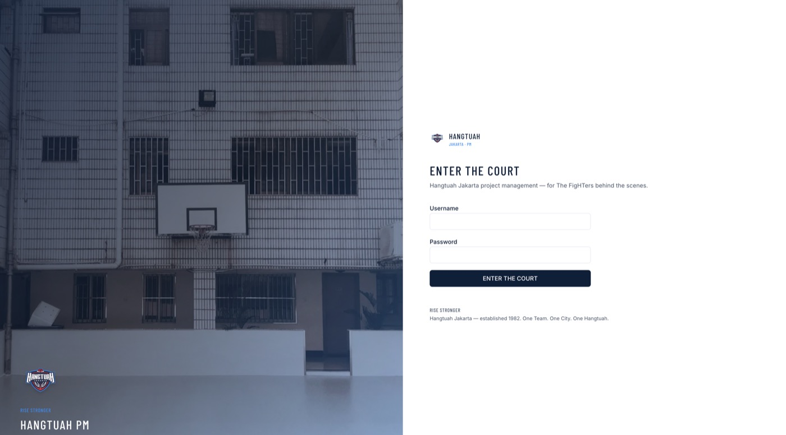

# Hangtuah Jakarta — Project Management (Kanban)

Kanban-style project management for Hangtuah Basketball Club divisions (Marketing, Merchandiser, Creative).

**Live:** [https://radr.nxtdev.xyz/hangtuahpm](https://radr.nxtdev.xyz/hangtuahpm)

## Screenshots

| Login | Fight Night dashboard | Empty kanban board |
|-------|----------------------|--------------------|
|  |  |  |

**Features shown:** JWT login with Hangtuah branding, leadership dashboard, and customizable empty-state placeholders on kanban boards.

## Stack

- Next.js 15.5 (App Router, Turbopack dev) + React 19 + TypeScript 5
- PostgreSQL 16+ with Prisma 6
- Custom JWT auth (username/password, admin-issued temp passwords)
- `@dnd-kit` Kanban + SSE realtime updates
- Hangtuah "Rise Stronger" brand theme (navy / sky / red)
- Tailwind CSS 4 + Radix UI primitives, Tiptap for rich-text cards

## Roles

| Role | Access |
|------|--------|
| **STAFF** | Own division workspace(s) only |
| **LEADERSHIP** | All workspaces + Fight Night dashboard |
| **ADMIN** | Full CRUD on users, workspaces, boards, tasks |

## Scripts

| Script | What it does |
|--------|--------------|
| `npm run dev` | Start Next.js dev server on port `3001` with Turbopack |
| `npm run build` | Production build |
| `npm start` | Run the production build on port `3001` |
| `npm run lint` | ESLint (Next.js config) |
| `npm run db:generate` | `prisma generate` |
| `npm run db:migrate` | `prisma migrate deploy` (use for prod / CI) |
| `npm run db:push` | `prisma db push` (schema sync, no migrations) |
| `npm run db:seed` | Run `prisma/seed.ts` (also wired as `prisma.seed`) |
| `npm run db:studio` | Open Prisma Studio |

## Local development

Requires PostgreSQL 16+ on your machine (or the VPS). Create DB + role:

```bash
sudo -u postgres psql -c "CREATE USER hangtuahpm_app WITH PASSWORD 'hangtuahpm_dev';"
sudo -u postgres psql -c "CREATE DATABASE hangtuahpm OWNER hangtuahpm_app;"
```

Then:

```bash
cp .env.example .env
# edit DATABASE_URL / JWT_SECRET if needed
npm install
npm run db:migrate   # or: npx prisma migrate deploy
npm run db:seed
npm run dev
```

Open [http://localhost:3001/hangtuahpm/login](http://localhost:3001/hangtuahpm/login)

> This Mac workspace does not ship with Postgres — run migrate/seed on the VPS (or any machine with Postgres) before first login.

### Seeded accounts

After `npm run db:seed`, demo users are created for each role. Temporary passwords are printed once in the seed script output — change them on first login. Do not commit or publish credentials.

## VPS deploy (PM2 + Nginx, no Docker)

Target: `/var/www/hangtuahpm` on the box that serves `radr.nxtdev.xyz`.

```bash
# on VPS
sudo mkdir -p /var/www/hangtuahpm /var/hangtuahpm/uploads /var/log/hangtuahpm /var/backups/hangtuahpm
sudo chown -R $USER:$USER /var/www/hangtuahpm /var/hangtuahpm/uploads

# sync code, then:
cd /var/www/hangtuahpm
cp .env.example .env   # set production secrets
npm ci
npm run db:migrate
npm run db:seed
npm run build
mkdir -p /var/log/hangtuahpm
pm2 start ecosystem.config.cjs
pm2 save
pm2 startup
```

Include [`deploy/nginx-hangtuahpm.conf`](deploy/nginx-hangtuahpm.conf) in the Nginx server block, then:

```bash
sudo nginx -t && sudo systemctl reload nginx
```

### Nightly backup (optional cron)

```bash
0 2 * * * pg_dump hangtuahpm | gzip > /var/backups/hangtuahpm/hangtuahpm-$(date +\%F).sql.gz
```

## Brand

Visual identity follows the Nov 2025 *Rise Stronger* rebrand:

- Official Hangtuah Jakarta crest (from hangtuah.id / IBL club logo CDN)
- Navy `#0B1F3A`, Sky `#0F8BF6`, Fight Red `#C8102E`
- Display font: Barlow Condensed
- Assets in `public/brand/`

### Imagery credits

- Login hero: [Photo by Kin Li on Unsplash](https://unsplash.com/photos/photo-1568861660872-cef3f9846366)
- Fight Night dashboard hero: [Photo by Syah on Unsplash](https://unsplash.com/photos/photo-1771882856158-c8e083134ee3)
- Club logo: Hangtuah Jakarta / IBL official crest (downloaded from hangtuah.id)

## Project conventions

- `.cursor/rules/github-account.mdc` pins the workspace to the `jrrqd` GitHub identity — local commit author and `gh` CLI user must match.
- App is served under the `/hangtuahpm` base path (set via `APP_BASE_PATH` in `.env`).
- API surface lives under `src/app/api/`; long-lived realtime uses SSE (`src/app/api/events/stream`).

## License

Hangtuah Jakarta — internal club use.
